<h2 style="text-align:center; "> Rye - Werribee - Torquay - Apollo Bay - Port Campbell </h2>

***
Map_of_GOR_Prt_1 
***

<h2 style="text-align:center; "> Day 26 - 16th Nov</h2>

<h3 style="text-align:center; "> Rye, Mornington Peninsular to Anglesea. </h3>

We are headed to the start of the Great Ocean Road at Torquay. Between the two places stands the metropolis of Melboure and the State Rose Garden at Werribee.
 
The drive around through the heart of Melbourne was a breeze. It was a Saturday but the traffic was free moving. Victorian drivers are super courteous.
 

 ***
Melbourne_CBD 
***

We arrived at the State Rose Garden at Werribee in time for a late breakfast. The day was hot already and heating up. The rose garden is massive but the roses were mostly just past their prime. Still beautiful to see.

 ***
Werribee_State_Rose_Garden_Entry 
***

 ***
Pano of Garden 
***

 ***
Trellised Roses 
***

 ***
Stunner 1
***

 ***
Stunner 2 
***

 ***
Torquay 
***

 ***
Torquay_Hot_Saturday 
***

<h2 style="text-align:center; "> Day 27 - 17th Nov</h2>

<h3 style="text-align:center; "> Anglesea - Aireys Inlet - Apollo Bay </h3>

The Great Ocean Road hugs the coastline and cliff tops from Anglesea to Apollo Bay.

 ***
Map_Anglesea_to_Apollo_Bay 
***

 ***
Anglesea_Beach_Cliffs/> 
***

 ***
Anglesea_Beach_Cliffs_1/> 
***

 ***
Aireys_Inlet_Castle_Rock_1 
***

 ***
Aireys_Inlet_Castle_Rock_2 
***

 ***
Aireys_Inlet_Castle_Rock 
***

 ***
Split_Point_Lighthouse 
***

 ***
Lorne 
***

 ***
Wye_River 
***

 ***
Apollo_Bay_Countryside 
***

 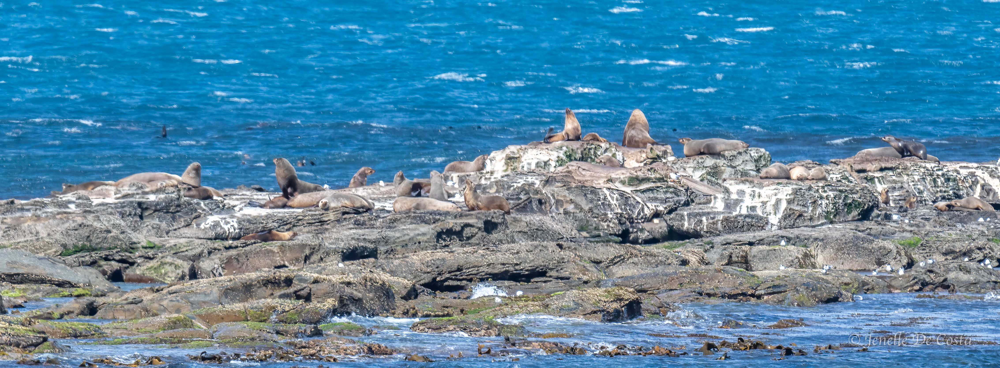
 ***
Fur Seals on the rocks at Apollo Bay 
***

<h2 style="text-align:center; "> Day 28 - 18th Nov</h2>

<h3 style="text-align:center; "> Apollo Bay - Port Campbell </h3>

The Great Ocean Road between Apollo Bay and Port Campbell was closed due to bushfires.
This meant we had to make a detour up over the Otway Ranges via Colac.

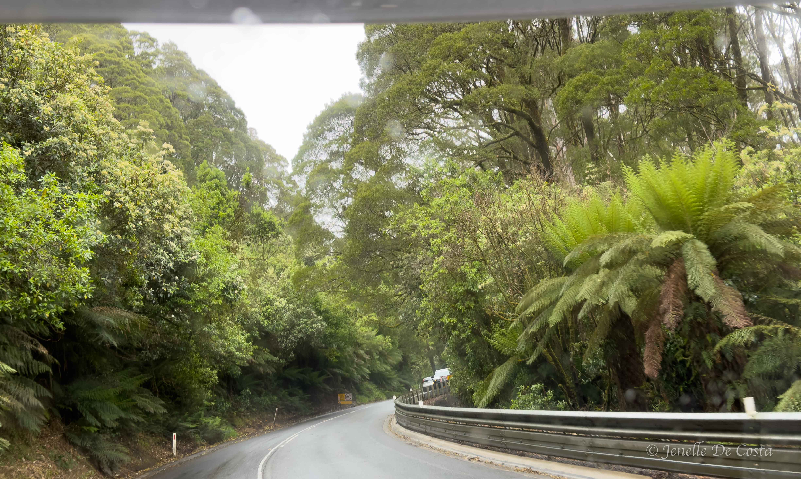
 ***
Otway_Ranges_Rainforest 
***

 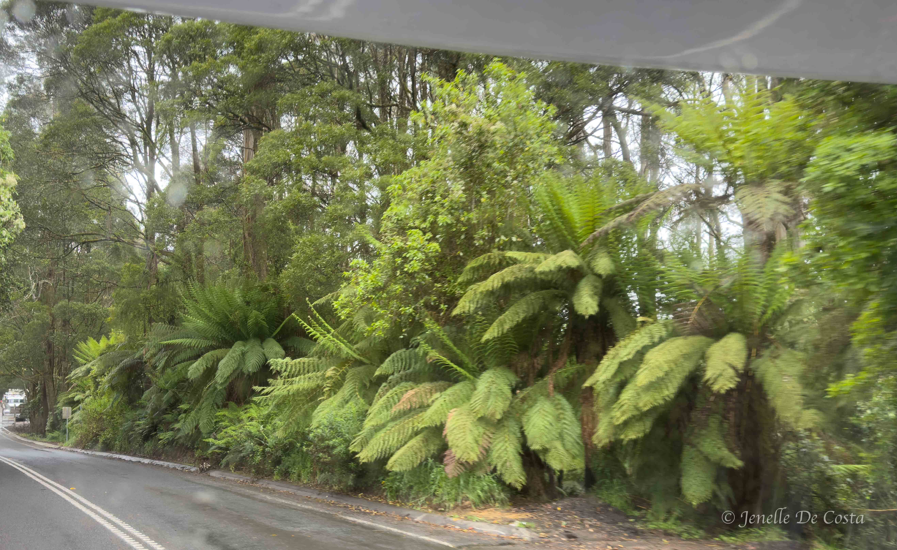
 ***
Otway_Ranges_Rainforest 
***

 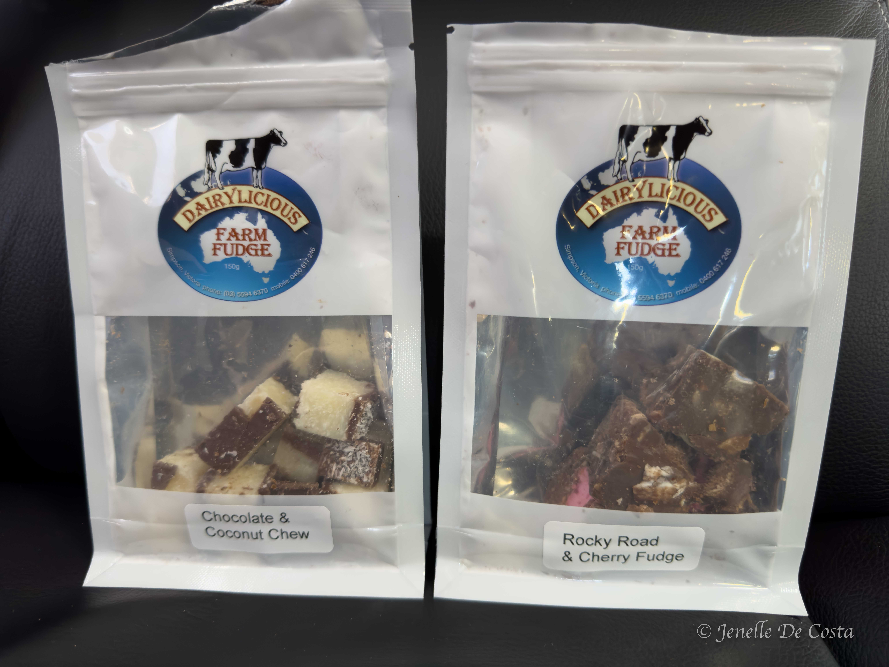
 ***
Colac_Farm_Shop_Fudge 
***

 ***
Port_Campbell_Beach 
***

 ***
Port_Campbell_Mural 
***

<h2 style="text-align:center; "> Day 29 - 19th Nov</h2>

<h3 style="text-align:center; "> The Twelve Apostles, Loch Ard, Razorback, Mutton Bird Island & Bakers Oven </h3>

Port Campbell is the epi-centre of the Great Ocean Road iconic scenery. Today we are photographing features to the east of Port Campbell.

 ***
The_Twelve_Apostles 1 
***

 ***
The_Twelve_Apostles Pano 
***

 ***
The_Twelve_Apostles_Cliffs 
***

 ***
The_Twelve_Apostles_Great_Ocean_Road 
***

 ***
The_Twelve_Apostles 3* 
***

 
 ***
East of The_Twelve_Apostles 
***

 ***
East of The_Twelve_Apostles 
***

 ***
Loch_Ard_1 
***

 ***
Loch_Ard_2 
***

 ***
Cave at Loch Ard 
***

 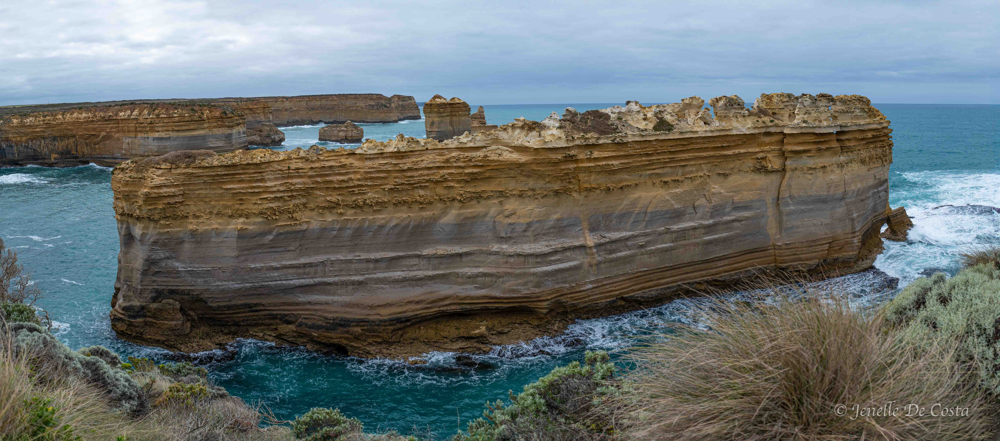
 ***
The_Razorback
***

 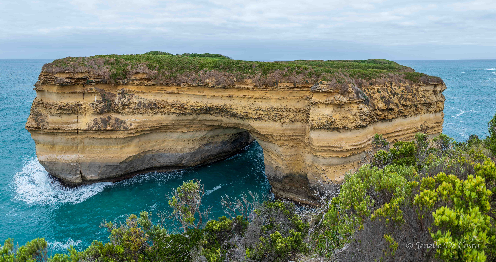
 ***
Mutton_Bird_Island 
***

 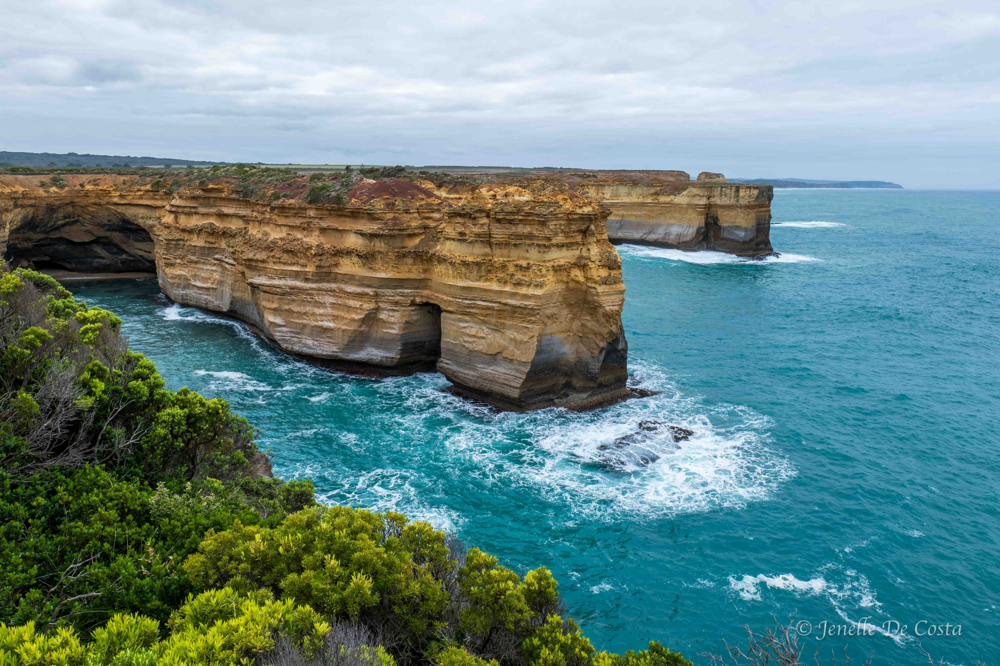
 ***
Mutton_Bird_Island Cliffs 
***

 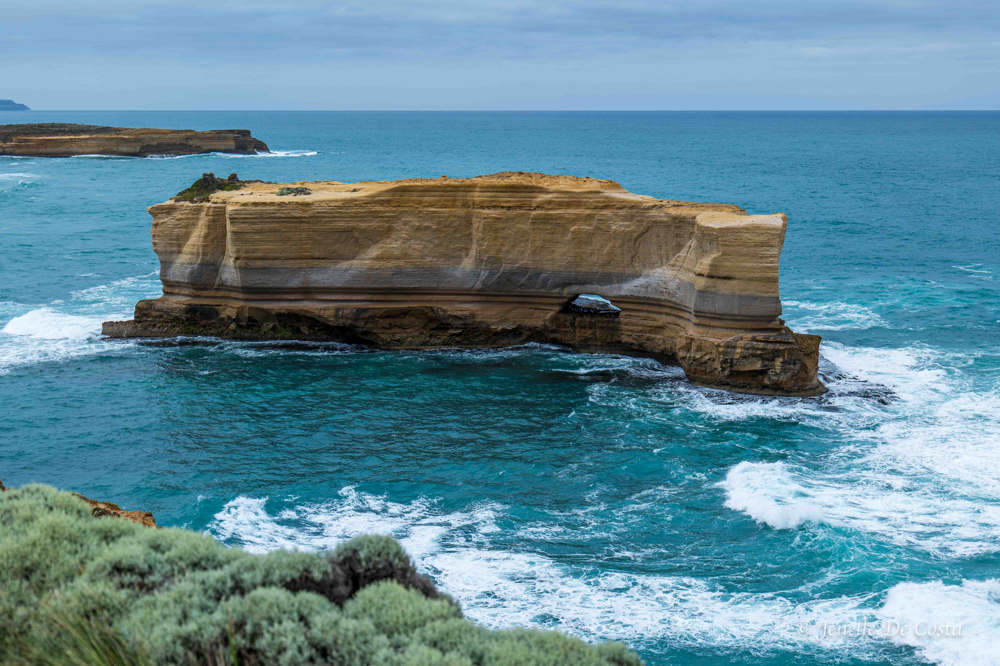
 ***
The_Bakers_Oven
***

 <h2 style="text-align:center; "> Day 30 - 20th Nov</h2>

<h3 style="text-align:center; "> West of Port Campbell to London Bridge, Petersborough, Bay of Islands, Childers Cove </h3>

 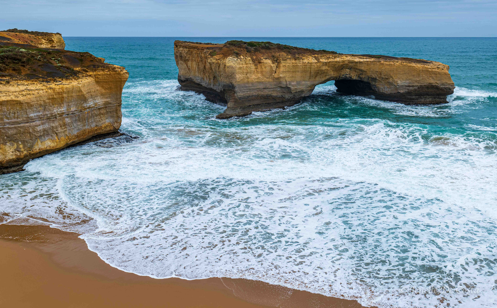
 ***
London Bridge 
***

 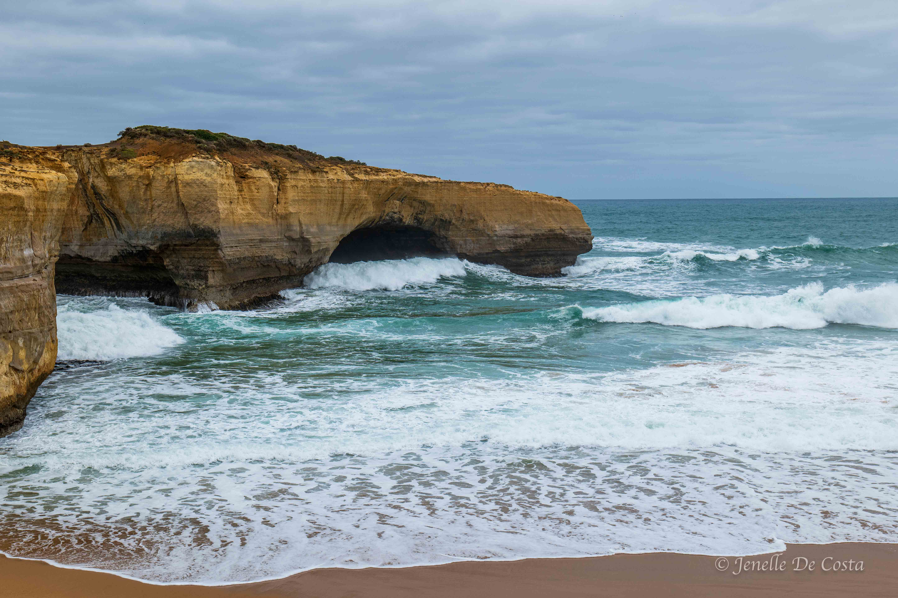
 ***
Wave coming through London Bridge 
***

 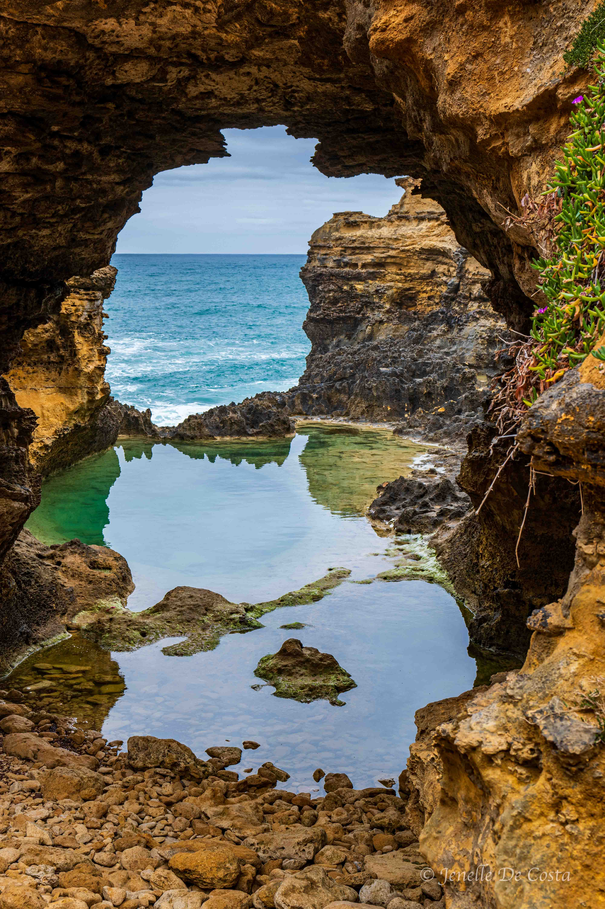
 ***
The_Groto 
***

 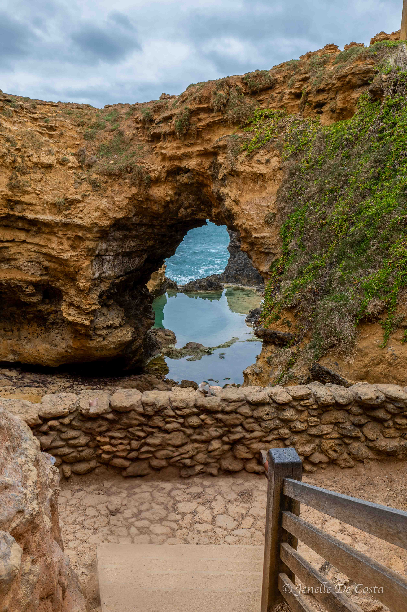
 ***
The_Groto 
***

 
  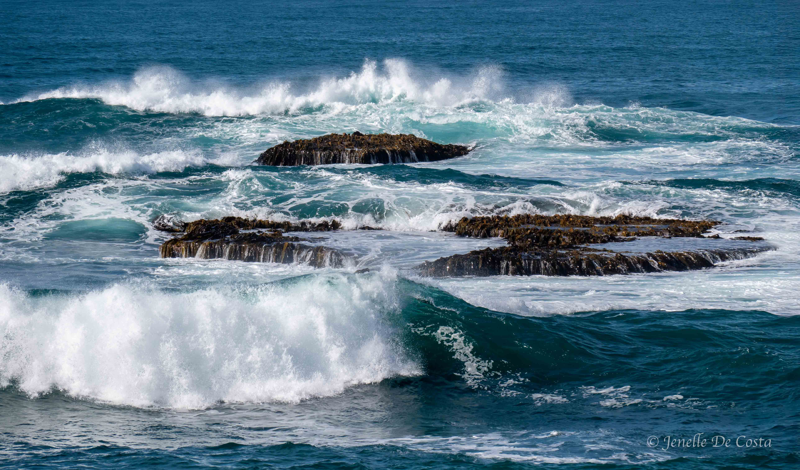
 ***
Peterborough 
***

 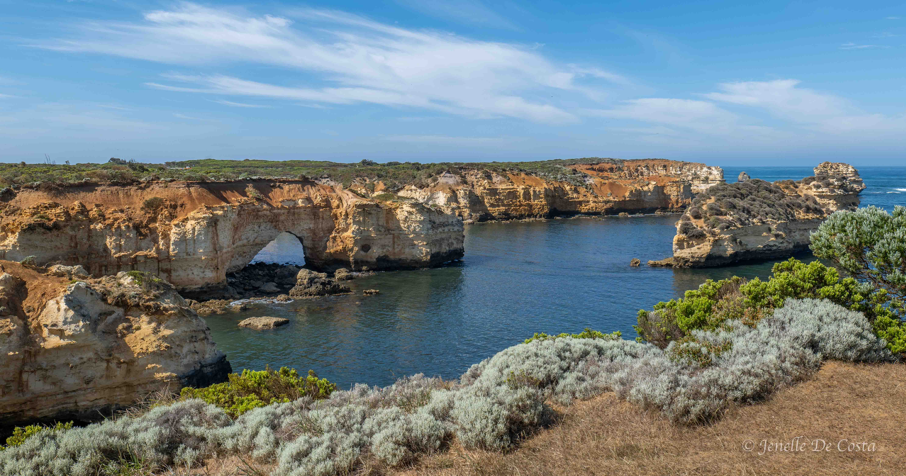
 ***
Bay_of_Islands 
***

 
 ***
Bay_of_Islands 
***

 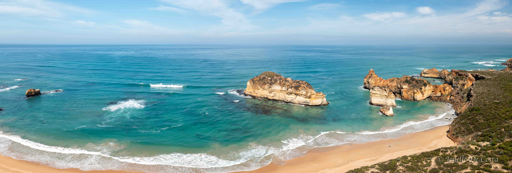
 ***
Childers_Cove from the sky 
***

 

 <!-- 
 ***
Replace 
*** -->
