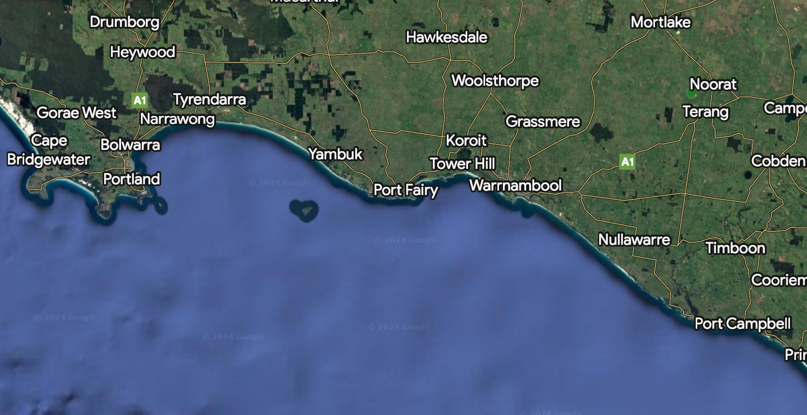
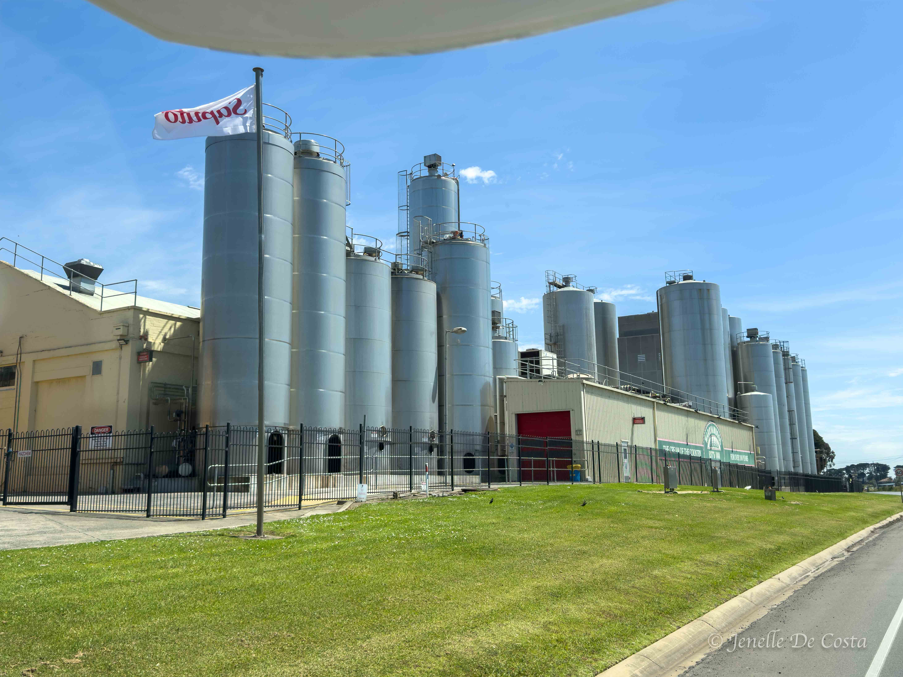
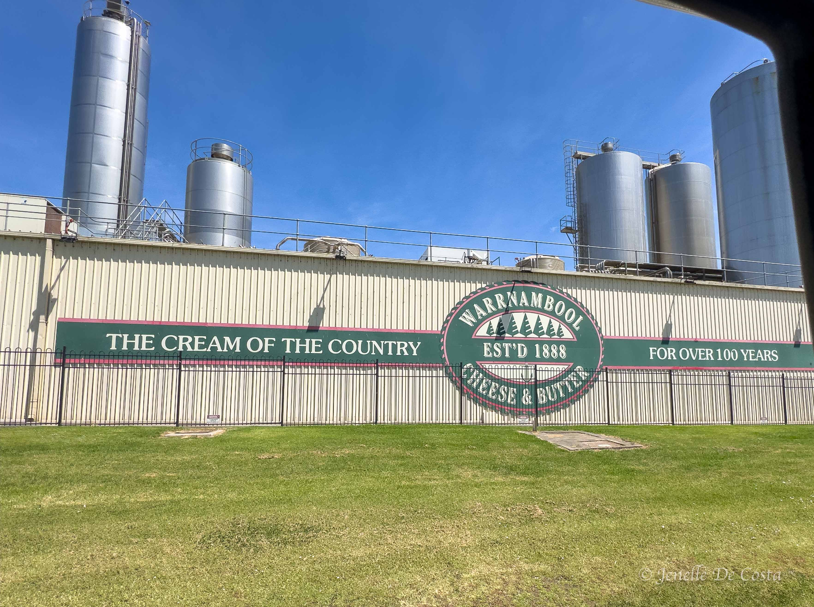
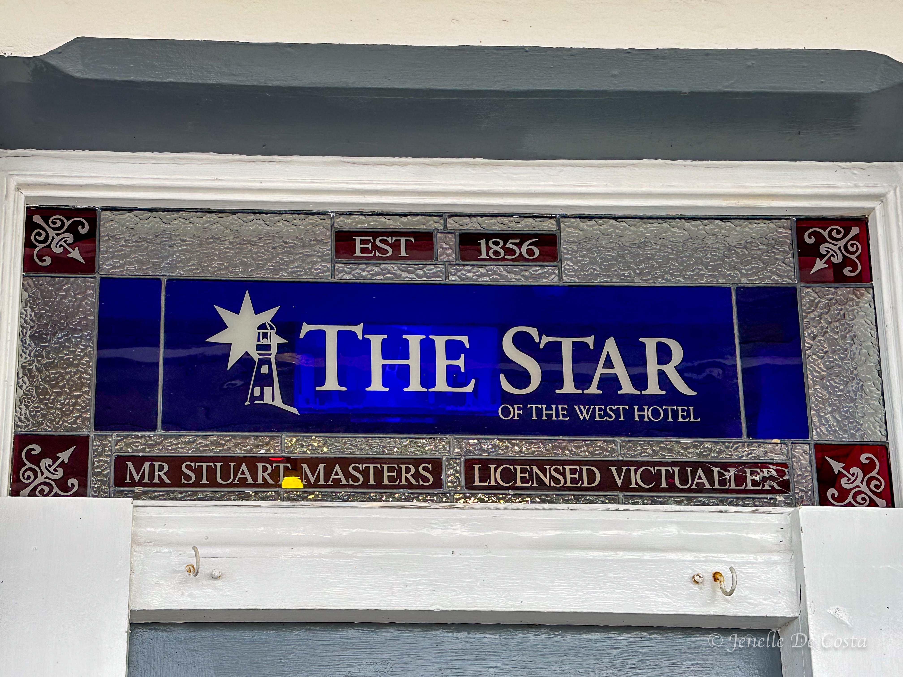

---

title: Great Ocean Road Part 2
subtitle: Victoria 2024
slug: Great_Ocean_Road_2
description: The western section of the Great Ocean Road. 
category:
  - Travel
tags:
  - Victoria_2024
  
pubDate: 2024-11-25
cover: https://res.cloudinary.com/drmvd4hkt/image/upload/v1735680767/Victoria_2024_Hero_Images/A_Hero_Port_Fairy_Lighthouse_P1412457_taslxu.jpg?w=1960&h=1102&auto=format&fit=crop&q=60&ixlib=rb-4.0.3

coverAlt: Port Fairy Lighthouse
author: John

---

<h2 style="text-align:center; "> Port Campbell - Warrnambool - Port Fairy - Portland </h2>

***
Map_of_GOR_Prt_2 
***

<h2 style="text-align:center; "> Day 31 - 21st Nov</h2>

<h3 style="text-align:center; "> Port Campbell to Warrnambool. </h3>

 ***
 Warrnambool_Cheese_Factory 
***

 
 ***
 Warrnambool_Cheese_Factory 
***

 
 ***
 Warrnambool_Cheese 
***

 
 ***
 Norfolk_Pine_Avenue 
***

 
 ***
 Warrnambool_Beach_Race_Horse_Training 
***

 
 ***
 Race_Horse_Training_in_Ocean 
***

<h2 style="text-align:center; "> Day 32 - 22nd Nov</h2>

<h3 style="text-align:center; "> Warrnambool. </h3>

 
 ***
 Tower_Hill_Crater 
***

 <h2 style="text-align:center; "> Day 33 - 23rd Nov</h2>

<h3 style="text-align:center; "> Warrnambool - Port Fairy - Portland. </h3>

 
 ***
 Port_Fairy_Lighthouse 
***

 
 ***
 Cottage_Port_Fairy 
***

 
 ***
 Harbour_Port_Fairy 
***

 
 ***
 Lighthouse_Port_Fairy 
***

 
 ***
 Port_Fairy_Hairdresser_Foyer 
***

 
 ***
 Port_Fairy 
***

 
 ***
 Port_Fairy_Old_Pub 
***

 ***
 Port_Fairy_Openning_Hours 
***

 
 ***
 Hay_Stacks in the fields around Portland 
***

 
 ***
 Country Cottage Near Portland 
***

 <h2 style="text-align:center; "> Day 34 - 24th Nov</h2>

<h3 style="text-align:center; "> Portland. </h3>

 ***
 Portland_Harbour 
***

 
 ***
 Portland_Harbour_Log_Stockpile 
***

 
 ***
 Gannet_Colony_Portland 
***

 
 ***
 Gannets_Portland 
***

 
 ***
 Poppy_Botanic_Gardens_Portland 
***

 
 ***
 Portland_Tourist_Tram 
***

 
 ***
 Portland_Rics_Pizza_Bar 
***

 
 ***
 Portland_Bakery 
***

 
 ***
 Fossilized_Forest_Rock_Formation 
***

 
 ***
 Cape_Bridgewater_Petrified_Fortest 
***

 
 ***
 Cape_Bridgewater_NP
***

<!-- 
 ***
 Replace 
*** -->

 <!-- 
 ***
 Replace 
*** -->

 <!-- 
 ***
 Replace 
*** -->

