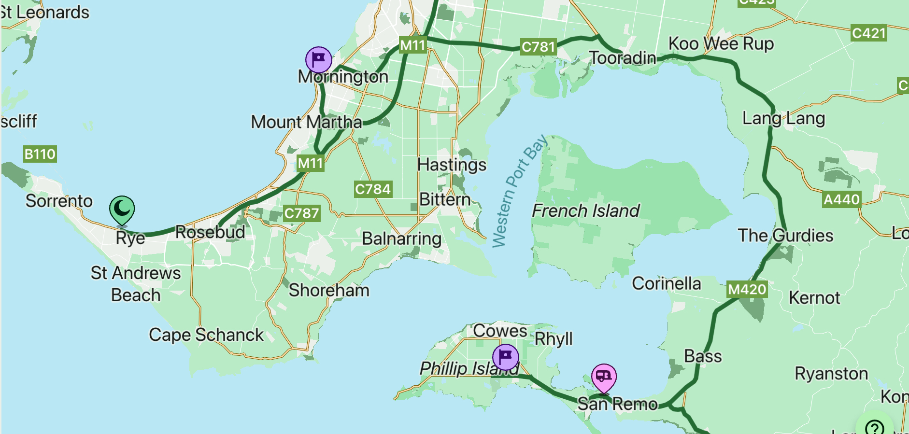
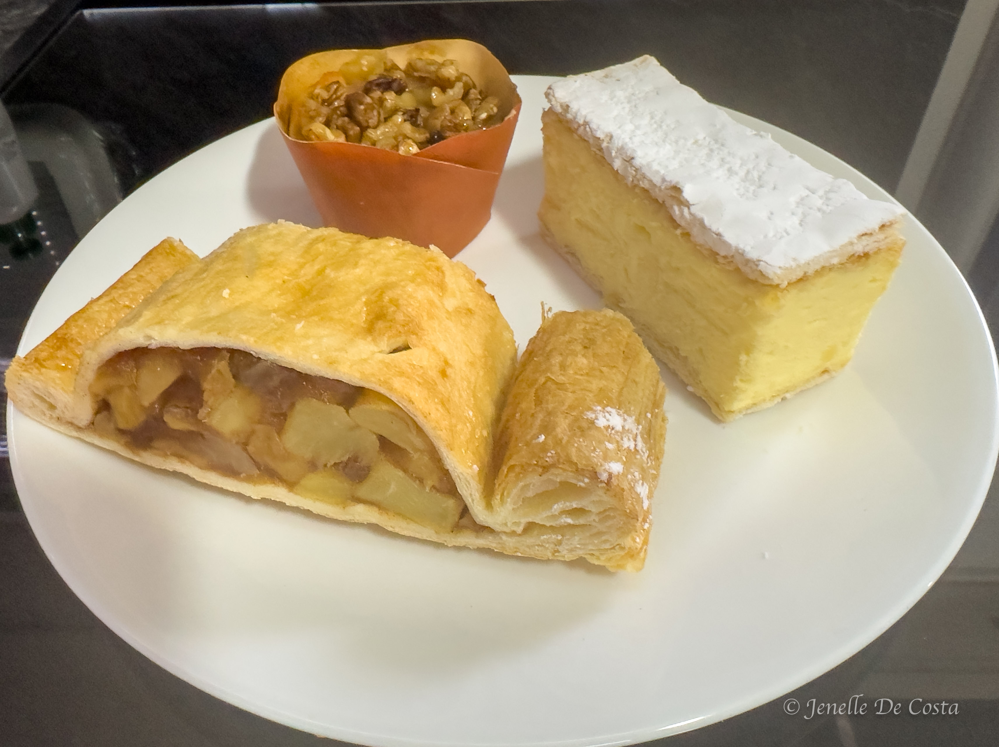
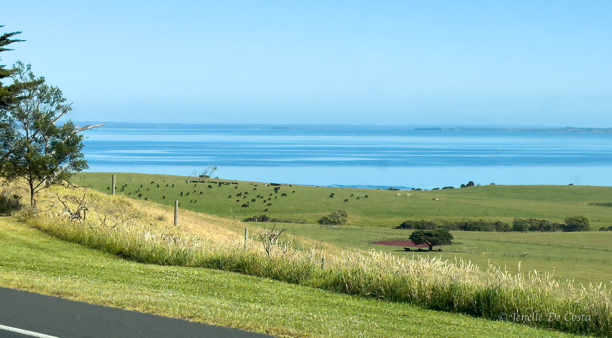
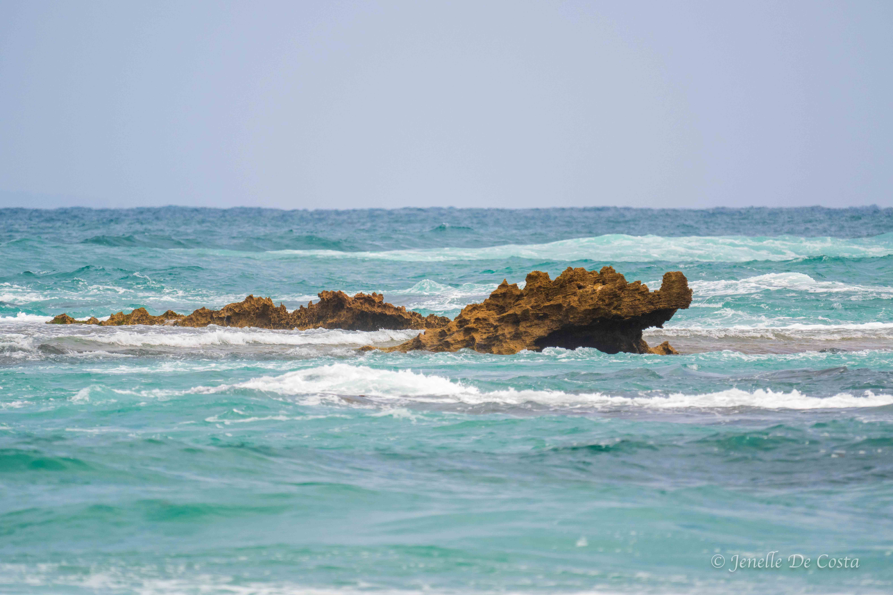
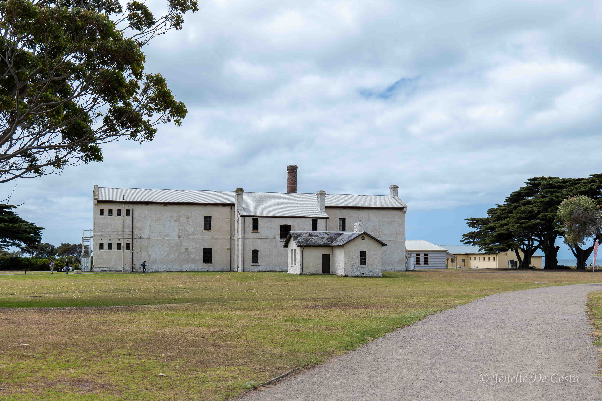
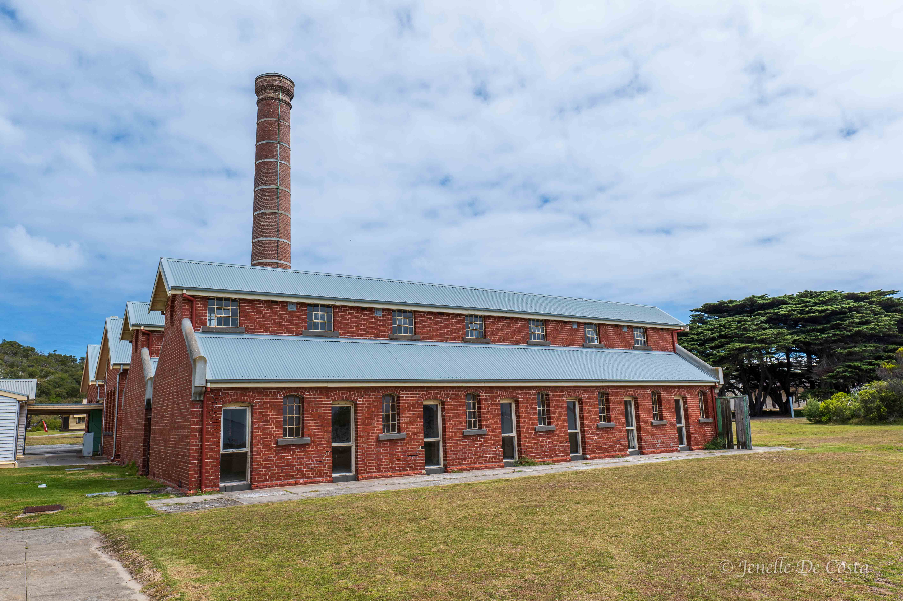
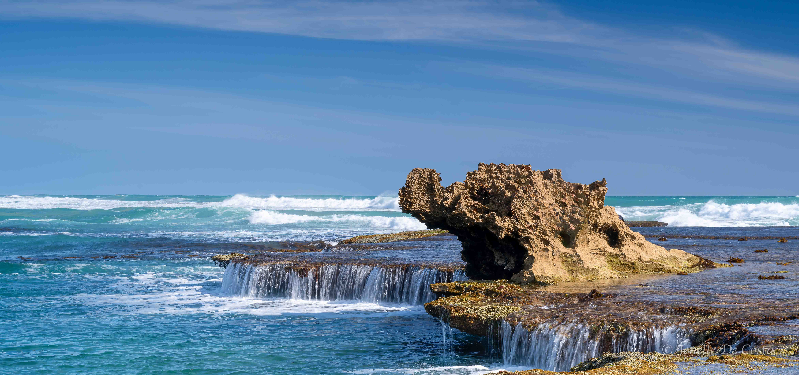
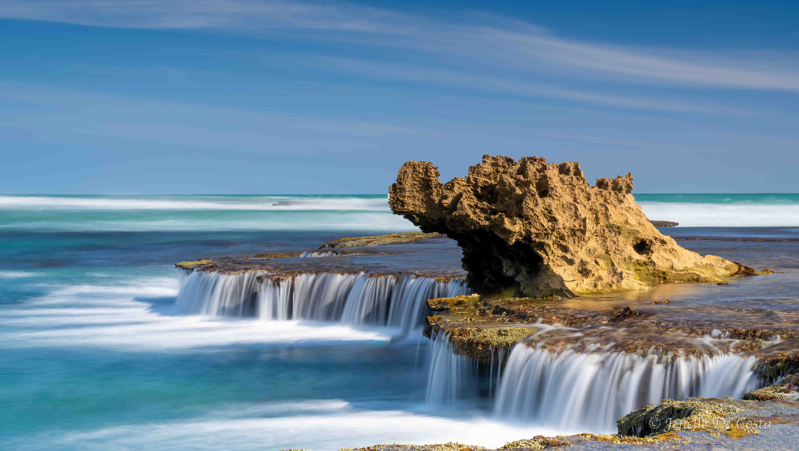
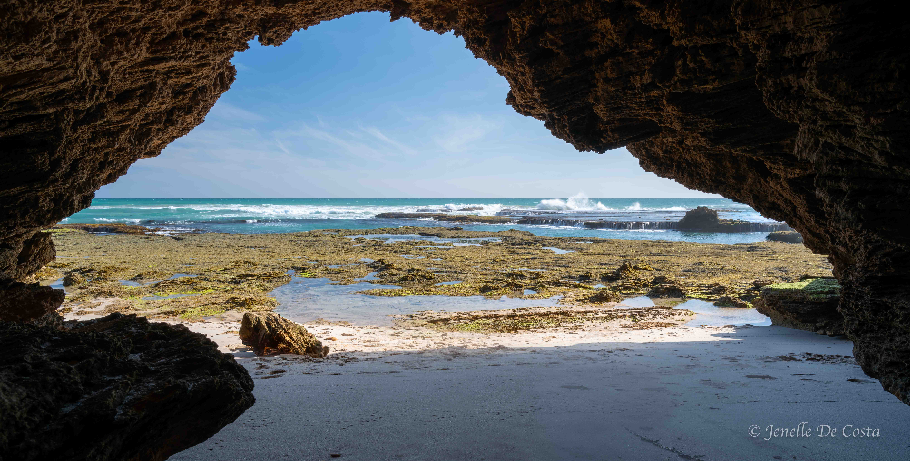

---

title: Mornington Peninsular
subtitle: Victoria 2024
slug: mornington_peninsular
description: Mornington Peninsular section of trip
category:
  - Travel
tags:
  - Victoria_2024
  
pubDate: 2024-11-16
cover: https://res.cloudinary.com/drmvd4hkt/image/upload/v1735680765/Victoria_2024_Hero_Images/A_Hero_Echidna_Mornington_Peninsula_DSC8043_ftje5m.jpg?w=1960&h=1102&auto=format&fit=crop&q=60&ixlib=rb-4.0.3
coverAlt: Echidna
author: John

---

<h2 style="text-align:center; "> Phillip Island - Mornington Peninsular </h2>

***
Mornington Peninsular route 
***

<h2 style="text-align:center; "> Day 24 - 14th Nov</h2>

<h3 style="text-align:center; "> Phillip Island to Rye on the Mornington Peninsular. </h3>

Before we left Phillip Island we made one last stop at the Bakery. 

***
 Phillip_Island_Bakery_Yummies...and taste as good as they look
*** 

Not far to travel today either. Phillip Is is on eastern side of Western Port while the Mornington Peninsular is on the western side. All we have to do is drive up and around.

***
 Western_Port 
*** 

Starting to get real close to Melbourne now. 
 
Easy drive. Good roads but lots of traffic now.
 
Our main objective here is to photograph The Dragon's Head. Our first stop was to reconnoiter the location. From the image below you can see we arrived at the wrong time. This is definately a low tide shot. Also we couldn't really make out the "Dragon's Head" like we had seen in photos. We checked the orientation and decided it must be an afternoon shot too.  

***
 Our first sight of The Dragon's Head. 
*** 

 
We drove the end of the Mornington Peninsular ( well as far as you an drive) and had lunch at the Old Quarantine Station. 

***
 Old_Quarantine_Station
*** 

 ***
 Old_Quarantine_Station 
*** 

When we came back in the afternoon, the tide was low and we discovered that to get on the "right-side" we would have to walk out across and around a large rock shelf covered in seaweed. With the potential of a rogue wave coming and sweeping the photographer or assistant to their death by drowning. Seem like fun.
 
We had been planning to leave the next morning but decided to stay another day to get the Dragon's Head shot.

<h2 style="text-align:center; "> Day 25 - 15th Nov</h2>

<h3 style="text-align:center; "> Mornington Peninsular. </h3>

Having spent the day at the caravan park, we headed out late afternoon to capture the Dragon's Head. Wouldn't you know it, there was a fisherman standing right in front. Jenelle was planning to photoshop him out but as luck had it he broken his line and was happy to stand aside while Jenelle got her shots.

***
 Dragon's Head sans fisherman
*** 

***
 The money shot of the Dragon's Head 
*** 

This is shot taken from a cave overlooking the Dragon's Head

***
 Dragon's Cave
*** 

<!-- 
***
 Replace 
***  -->