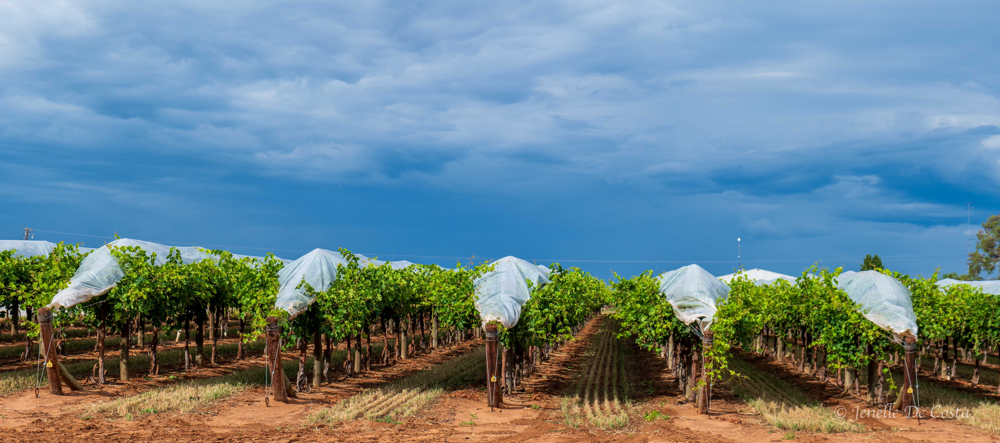

---

title: Murray River
subtitle: Victoria 2024
slug: Murray_River
description: Going around the outside of Sydney through Dunedoo and Mudgee. 
category:
  - Travel
tags:
  - Victoria_2024
  
pubDate: 2024-12-04
cover: https://github.com/thefoxboxman/Hero_Images/blob/main/A_Hero_Echuca_Paddlesteamer_Canberra_P1422734.jpg?raw=true?w=1960&h=1102&auto=format&fit=crop&q=60&ixlib=rb-4.0.3
coverAlt: Map of route bypassing Sydney
author: John

---

<h2 style="text-align:center; "> Robinvale - Swan Hill - Echuca - Cobram - Rutherglen - Wodonga </h2>

***
Map_Murray_River_Route 
***

<h2 style="text-align:center; "> Day 40 - 30th Nov</h2>

<h3 style="text-align:center; "> Robinvale - Swan Hill </h3>

***
 Robinvale_Almond_Groves 
***

***
 Robinvale_Almond_Groves 
***

***
 Robinvale_Almond Close up 
***

***
 Robinvale_Asparagus 
***

***
 Robinvale_Grapes 
***

***
 Robinvale_Grapes 
***

***
 Robinvale_Grapes 
***

***
 Lock on the Murray_River at Robinvale 
***

***
 Murray_River_Robinvale 
***

***
 Murray_River_Robinvale 
***

***
 Murray_River_Robinvale 
***

***
 Murray_River_Robinvale 
***

***
 Produce_Robinvale 
***

<h2 style="text-align:center; "> Day 41 - 1st Dec</h2>

<h3 style="text-align:center; "> Swan Hill to Echuca </h3>

***
 Swan_Hill_Big_Murray_Cod 
***

***
 Swan_Hill_Markets 
***

***
 Swan_Hill_Markets 
***

***
 Swan_Hill_Murray_River 
***

***
 Swan_Hill_Nectarines 
***

***
 Pistachio_Orchard_Swan_Hill 
***

***
 Swan_Hill_Water_Tower 
***

***
 Swan_Hill_Wheat_Field 
***

***
 Lake_Boga_Silo_Art
***

<h2 style="text-align:center; "> Day 42 - 2nd Dec</h2>

<h3 style="text-align:center; ">  Echuca </h3>

***
 Echuca_Coffee_Palace 
***

***
 Crimson-Yellow_Rosella 
***

***
 Fordson_Tractor 
***

***
 Echuca_Hotrod 
***

***
 Echuca_Houseboats 
***

***
 Echuca_Old_School 
***

***
 Echuca_Party_Boat
***

***
 Port_of_Echuca_Museum_ 
***

***
 Echuca_Paddlesteamer_Canberra 
***

***
 Echuca_River_Bank_Museum 
***

***
 Echuca_Street_Art 
***

<h2 style="text-align:center; "> Day 43 - 3rd Dec</h2>

<h3 style="text-align:center; ">  Echuca to Cobram </h3>

***
 Murray_River_Cobram 
***

***
 Thompsons_Beach_Cobram 
***

***
 Murray_Cod_Thompsons_Beach_Cobram 
***

<h2 style="text-align:center; "> Day 44 - 4th Dec</h2>

<h3 style="text-align:center; ">  Cobram, Yarrawong, Rutherglen, Wodonga, Gundagai </h3>

***
 Yarrawonga_Weir_Murray_River 
***

***
 Yarrawonga_Lake_Mulwala 
***

***
 Crimson-Yellow_Rosella 
***

***
 Wine-bottle_Water_Tower Rutherglen 
***

***
 ReplaceRutherglen_Parker_Pies 
***

***
 ReplaceRutherglen_Parker_Pies 
***

***
 Wodonga_Hume_Dam 
***

***<h2 style="text-align:center; "> Off to Gundagai for the first stop on the way home. </h2>***
 
 
 
<!-- 
***
 Replace 
*** -->
