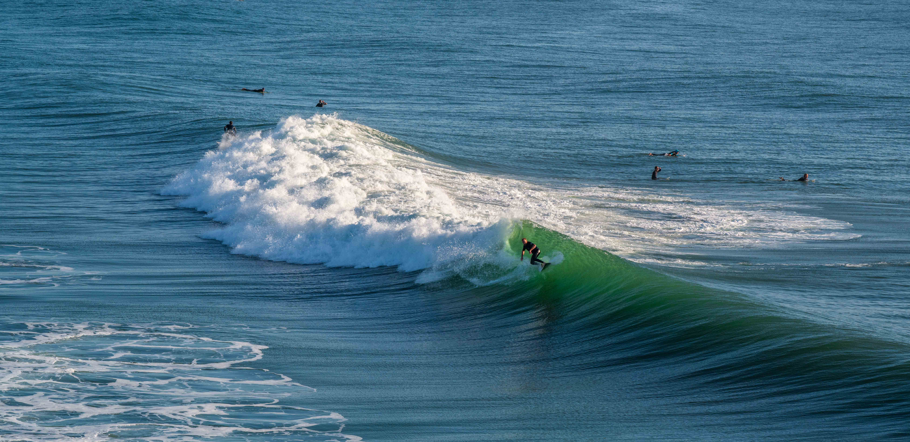

---

title: NSW North Coast
subtitle: Victoria 2024
slug: NSW-Nth-Coast
description: First section of trip around Victoria 
category:
  - Travel
tags:
  - Victoria_2024
  - NSW_North_Coast
  
pubDate: 2024-10-24
cover: https://res.cloudinary.com/drmvd4hkt/image/upload/v1735680765/Victoria_2024_Hero_Images/A_Hero_Ballina_Surfers_Lennox_Head_DSC6797_bcralq.jpg
coverAlt: Surfers at Lennox Head break
author: John

---

<Image />
<h2 style="text-align:center; "> Toowoomba - Ballina - South West Rocks </h2>
 
 
 ***
 Map of northern NSW Coast stage 
***

<h2 style="text-align:center; "> Day 1 - 22nd October</h2>

<h3 style="text-align:center; "> Torringtom - Toowoomba Bypass - Warrego Highway - Logan Motorway - M1 - Ballina. </h3>

 

  After a hectic month or so of visitors etc we packed up and headed off at 9am. It felt great to be back on the road.

  We checked into the Discovery Park for 2 nights.

 
 ***
 Silky water effect shot at Boulder Beach, Ballina
***
\
 
 ***
 Lennox Head 
***

 ***
Lennox Head***
 
 ***
 Surfers at Lennox Head break 
***

<h2 style="text-align:center; "> Day 2 - 23rd Oct</h2>

<h3 style="text-align:center; "> Ballina - Byron Bay - Killin Falls </h3>  

  Up early morning to photograph the rocks, headlands and waves north of Ballina up to Lenox Head. This area is paradise. Awesome scenery. Goldilocks weather.

  Afterwards we headed up to Byron Bay arriving about 9.00am. We didn't go anywhere near town, just up to the lighthouse at Cape Byron. The place was heaving with people. Mostly joggers and walkers. And mostly foreign tourist judging by the variety of languages we overheard.

  Leaving Byron Bay to the trendy set we headed into the hinterland to visit the Killen Falls.

 
 ***
 Cape Bryon Lighthouse 
***
 
 
 
 
 ***
 Cape Byron - Most Eastly Point in Australia 
***

 
 ***
 Killen Falls 
***

 
 ***
 The Big Prawn at Ballina 
***
 

<h2 style="text-align:center; "> Day 3 - 24th Oct</h2>

<h3 style="text-align:center; "> Ballina - Brooms Head - Woolgoolga - Coffs Harbour - South West Rocks. </h3>

 From Ballina we headed to Brooms Head further south along the coast. Not to the actual town, but up a dirt road behind the coastal wetland to photograph a feature in the salt-pans call "The Tree of Life".

 From here it was on to Woolgoolga to stock up on cakes and pastries at the legendary Woopi Bakery.

 We checked into the NMRA Caravan Park (Resort) at South West Rocks. Considering this is not school holidays and it is mid-week the park was full to overflowing with families and kids. And the name suggests it is resort for families. The entertainment facilities for kids are fantastic. 

 
 ***
 Brooms Head "Tree of Life
***

 
 
 ***
 South West Rocks - Trial Bay 
***
 

 
 ***
 outh West Rocks Caravan Park Goanna 
***
 

 <!-- 
 ***
 Replace 
*** -->
