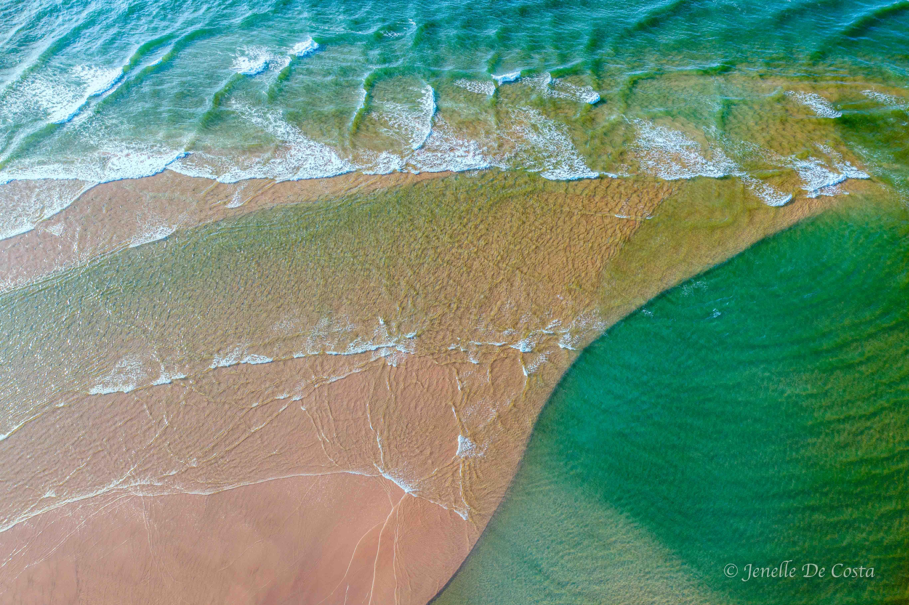

---

title: NSW Return Trip
subtitle: Victoria 2024
slug: NSW_Return_Trip
description: Going home via NSW North Coast 
category:
  - Travel
tags:
  - Victoria_2024
  
pubDate: 2024-12-04
cover: https://images.unsplash.com/photo-1735434177126-ea03fe13a846?q=80&w=2640&auto=format&fit=crop&ixlib=rb-4.0.3&ixid=M3wxMjA3fDB8MHxwaG90by1wYWdlfHx8fGVufDB8fHx8fA%3D%3D
coverAlt: Map of route going home via NSW North Coast 
author: John

---

<h2 style="text-align:center; "> Gundagai - Harrington - Crescent Head - Woolgoolga - Gold Coast - Toowoomba </h2>

***
Map_Return_Trip 
***

<h2 style="text-align:center; "> Day 45 - 5th Dec</h2>

<h3 style="text-align:center; "> Gundagai to Crowdy Head (Harrington) </h3>

***
 Gundagai_Historic_Rail_Bridge 
***

***
 Gundagai_Murrumbidgee_River 
***

Today's route is straight up the M31 onto the M1 trough Sydney (avoiding Toll roads), back onto the M1 and onto the A1 heading north. Our first stop was a the Deerubbun Rest Area on the banks of the Hawkesbury river. 

***
 Map_Gundagai_Deerubbun Rest Stop 
***

From Deerubbun we continued north pass Newcastle parking up in Harrington/Crowdy Head on the coast near Tarree.
 
Total milage today was just over 700km which took about 10 hours of travel time. All this on motorways with no slow traffic.

***
 Harrington_Manning_River_Mouth 
***

***
 Harrington_Breakwater 
***

***
 Manning_River_Mouth 
***

<h2 style="text-align:center; "> Day 46 - 6th Dec</h2>

<h3 style="text-align:center; ">Crowdy Head (Harrington) </h3>

Rest day at Harrington.

***
 Crowdy_Head_Lighthouse 
***

<h2 style="text-align:center; "> Day 47 - 7th Dec</h2>

<h3 style="text-align:center; ">Harrington to Crescent Head </h3>

***
 Map_Harrington_Woolgoola_Section 
***

***
 Coopernook_NSW_Kingfisher_Cattia_Wetlands 
***

***
 Crescent_Head 
***

***
 Crescent_Head 
***

***
 Crescent_Head 
***

***
 Crescent_Head 
***

***
 Crescent_Head 
***

***
 Crescent_Head 
***

<h2 style="text-align:center; "> Day 48 - 8th Dec</h2>

<h3 style="text-align:center; ">Crescent Head </h3>

***
 Crescent_Head 
***

***
 Crescent_Head 
***

***
 Crescent_Head 
***

***
 Crescent_Head 
***

<h2 style="text-align:center; "> Day 49 - 9th Dec</h2>

<h3 style="text-align:center; ">Crescent Head to Woolgoolga </h3>

Overnight stop only....be here before a couple of times. Mainly to go to the bakery.

<h2 style="text-align:center; "> Day 50 - 10th Dec</h2>

<h3 style="text-align:center; ">Woolgoolga to Chindera (Kingscliff) </h3>

Dropped into check out Evans Head on the way through. No need to go again.

***
 Evans Head 
***

<h2 style="text-align:center; "> Day 51 - 11th Dec</h2>

<h3 style="text-align:center; ">Chindera (Kingscliff) - Hinterland Caravans (Burleigh) - Home </h3>

Motorhome (House service) done today at Hinterland Caravans (Avida Dealer).
 
Home by about 2.30pm. Time to unpack!

***<h2 style="text-align:center; "> Trip Summary </h2>***

<h3 style="text-align:center; "> Total Distance: 7,871 km</h3>
<h3 style="text-align:center; "> Fuel Consuption: 12.7 L/100km </h3>
<h3 style="text-align:center; "> Average Speed: 54 km/h </h3>
<h3 style="text-align:center; "> Driving Time: 146.5 hours </h3>

 
 
 
 