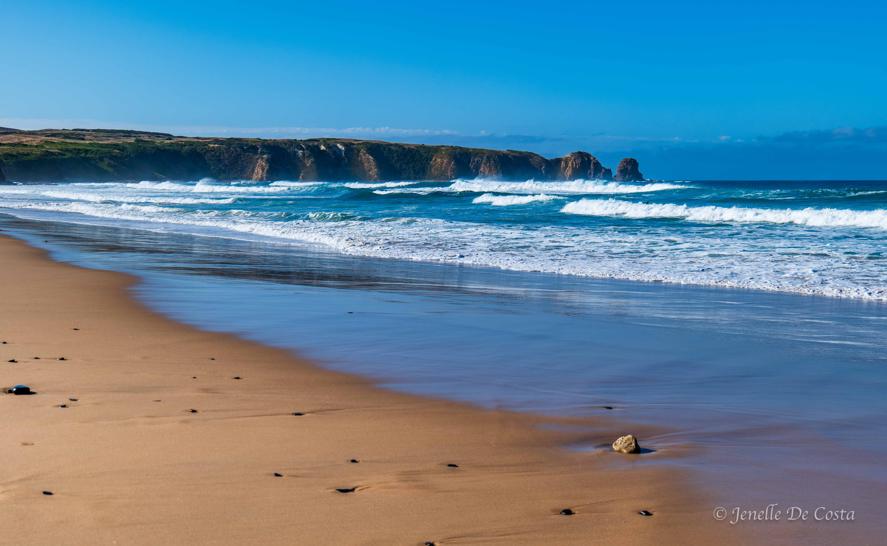

---

title: Phillip Island
subtitle: Victoria 2024
slug: phillip_island
description: Exploring Phillip Island
category:
  - Travel
tags:
  - Victoria_2024
  
pubDate: 2024-11-14
cover: https://github.com/thefoxboxman/Hero_Images/blob/main/A_Hero_The_Pinnancles_Cape_Woolamai_Phillip_Island_2_P1064861.jpg?raw=true?w=1960&h=1102&auto=format&fit=crop&q=60&ixlib=rb-4.0.3
coverAlt: The Pinnacles, Cape Woolamai, Phillip Island
author: John

---

<h2 style="text-align:center; "> Inverloch - Wonthagi - Phillip Island </h2>

***
Phillip Island route 
***

<h2 style="text-align:center; "> Day 21 - 11th Nov</h2>

<h3 style="text-align:center; "> Inverloch - Wonthagi - Phillip Island. </h3>

Short travel day today. Just 54km. On the way we stop at Wonthagi to do some food shopping. We also acquired an Australia Post Prepaid Mastercard to replace John's NAB Visa which had been hacked and therefore blocked again.
 
We arrived a the caravan park which was just over the bridge to Phillip Island  at 10.30; too early to check in. We went to explore Phillip Is which is surprising big.

 ***
 The bridge to Phillip Is. 
***

 Drove over 3km on a rough gravel road to get to Pyramid Rock lookout. Along the way we spotted an Echidna.

 ***
 Pyramid_Rock 
***

 

 ***
 A very obliging Echidna 
***

 ***
 The Nobbies 
***

The Nobbies is a headland at the end of the Summerland Peninsular. This area includes the Penguin Parade, a crested Tern hatchery, seagull hatchery and Little Penguin hatchery. This is addition to the scenic headlands, rock formations and blowholes. Any wonder Jenelle finished the day with over 320 photos to sort.

 ***
 The_Nobbies
***

And Cape Barren Geese by the score.

 ***
 Cape_Barren_Goose 
***

 ***
 Cape Barren Goose 
***

 ***
 Crested_Terns 
***

 ***
 Seagull_Chick 
***

 ***
 Little_Penguins 
***

 ***
 The Blowhole 
***

 ***
 More rocky headlands at the Nobbies 
***

<h2 style="text-align:center; "> Day 22 - 12th Nov</h2>

<h3 style="text-align:center; "> Phillip Island. </h3>

Today we are off for a  6km return hike to the Pinnicales at Cape Woolami. 

 ***
 Cape_Woolamai 
***

 ***
 The Pinnacles, Cape Woolamai, Phillip Island 
***

 ***
 The Pinnacles, Cape Woolamai 
***

 ***
 Woolamai_Surf_Beach 
***

 One the way back to the van park we discover the Philip Island Bakery. Seem popular. John had a scollop pie and Jenelle had a chicken and corn pie. Too good. Eaten to fast for photos. Also bought a pecan tart and vanilla slice for desert.

 ***
 Phillip_Island_Bakery 
***

<h2 style="text-align:center; "> Day 23 - 13th Nov</h2>

<h3 style="text-align:center; "> Phillip Island. </h3>

It is raining and misserable today. Had a bit of a drive around the mainland adjacent and went to a few bird watching areas without much luck. Good weather for Phillip Island Bakery pies for lunch though.

<!-- 
 ***
 Replace 
*** -->
 