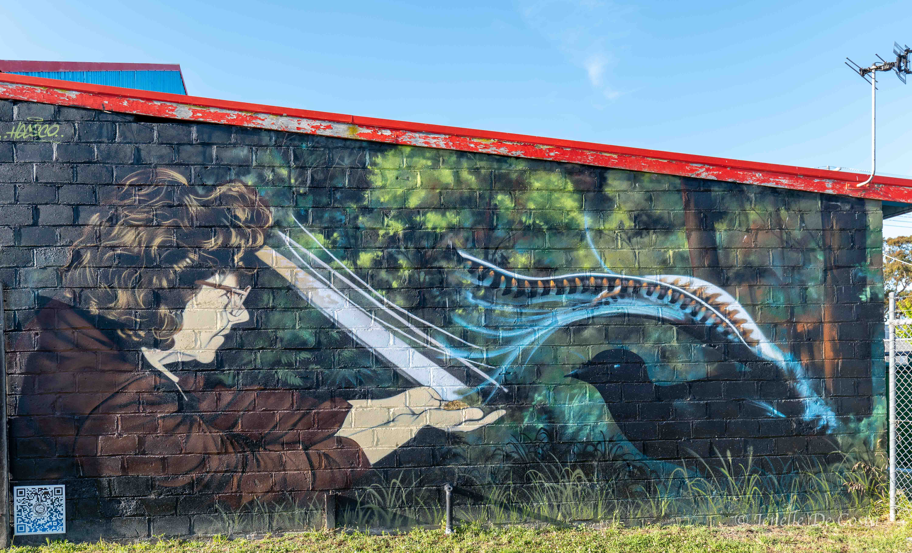
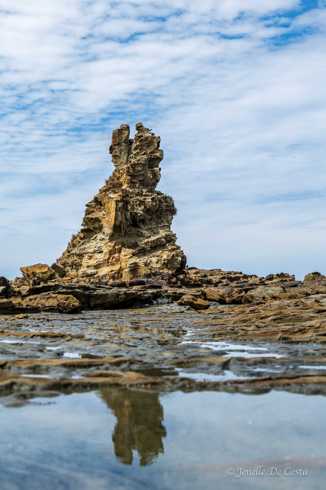

---

title: South Gippsland
subtitle: Victoria 2024
slug: South_Gippsland
description: South Gippsland region
category:
  - Travel
tags:
  - Victoria_2024
  
pubDate: 2024-11-10
cover: https://res.cloudinary.com/drmvd4hkt/image/upload/v1735680767/Victoria_2024_Hero_Images/A_Hero_Eagles_Nest_Rock_Inverloch_2_P1064786-Edit-Edit_evujr6.jpg

coverAlt: South Gippsland
author: John

---

<h2 style="text-align:center; "> Sale - Yarram - Inverloch </h2>

***
South Gippsland route 
***

<h2 style="text-align:center; "> Day 17 - 7th Nov</h2>

<h3 style="text-align:center; "> Lakes Entrance - Sale - Yarram. </h3>

 We thought was our final distingation for the day would be Sale. Though pleasant, Sale is another large regional town and it just did't inspire us to stay.
 
We drove on to our next planned stay at Yarram. It was love at first sight.

 ***
 The Shearer and his dog - Heesco_Mural_Yaram 
***

The Yarram community and Heesco Khosnaran, who is a Melbourne based street artist, combined to install 24 murals on the buildings in and around Yarram. This has lead to a "street art" inspired rerenaissance for the previously fading village.
This a link to the Yarram Hesscotown project: https://heescotown.com
This a link to Heesco Khosnaran's other work: https://www.heesco.com/portfolio 
Below are a few of the other murals Jenelle photographed around Yarram.

 ***
 Heesco_Mural_Yarram 
***

 ***
 Tara Bulga National Park - Heesco_Mural_Yarram 
***

 ***
 alph Vale - Local Bullocky - Heesco_Mural_Yarram 
***

 ***
 Ada Crossley Opera Singer - Heesco_Mural_Yarram 
***

 ***
 Battle of Beersheba - Heesco_Mural_Yarram 
***

 ***
 Tribute to Emergency Services of Yarram by Heesco 
***

<h2 style="text-align:center; "> Day 18 - 8th Nov</h2>

<h3 style="text-align:center; "> Yarram - Agnes Falls - Weshpool - Port Albert - Yarram. </h3>

 ***
 Agnes_Falls_Yaram 
***
 

 ***
 One of countless Dairy Herds in the Gippslands 
***

 

 ***
 airy Country 
***

 ***
 Zoomed out Dairy Country 
***

Down to the coast again for breakfast at Port Weshpool.

 ***
 Port_Weshpool_Jetty
***

 
Then just around the corner to Port Albert.

 ***
 Port_Albert_Harbour 
***

 The ports in this area service the oil and gas rigs in Bass Strait.

 ***
 Port_Albert 
***

Then back to Yarram...
 
 
 ***
 Old_Court_House_Yarram 
***

 <h2 style="text-align:center; "> Day 19 - 9th Nov</h2>

<h3 style="text-align:center; "> Yarram to Inverloch. </h3>

Leaving Yarram today, we took the senic route, with our first stop being in the little village of Fish Creek. The small rural village is undergoing a renewal lead by artist's studios and to die for coffee shops. After a few delectable pastries from the "Little Oberon" cafe we set off to Inverloch.

 ***
 Fish Creek 
***

 ***
 Fish Creek 
***

Inverloch being only 150km from downtown Melboure and is a major holiday destination. The caravan park where we are parked up is humongous. Half is a large family resort style van park. It is fully fenced and full of happy screaming kids. The other half is sites set amongst nature.  It is cheaper, not so crowded and way more tranquil.
 

The main notable natural feature of Inverloch is the rock formation known as the Eagles Nest Rock.

 ***
 Eagles Nest Rock Inverloch 
***

 

 ***
 Eagles Nest Rock 
***

 ***
 Eagles Nest Rock 
***

<h2 style="text-align:center; "> Day 20 - 10th Nov</h2>

<h3 style="text-align:center; ">  A day in Inverloch. </h3>

Walked up town, did our washing and walked around the beach front.

 ***
 Inverloch_War_Memorial 
***

<!-- 
 ***
 Replace 
*** -->

 <!-- 
 ***
 Replace 
*** -->