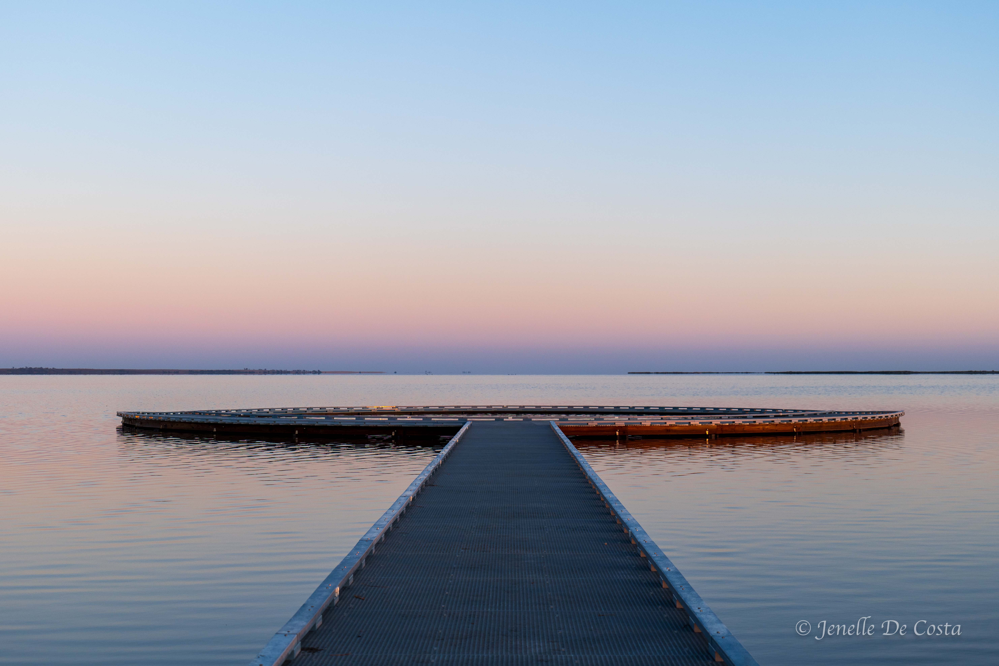

---

title: Wimmera-Malley
subtitle: Victoria 2024
slug: Wimmera_Malley
description: Wimmera & Malley Regions of Victoria 
category:
  - Travel
tags:
  - Victoria_2024
  
pubDate: 2024-11-30
cover: https://github.com/thefoxboxman/Hero_Images/blob/main/A_Hero_Natimuk_Wheat_Fields_IMG_6508.jpg?raw=true?w=1960&h=1102&auto=format&fit=crop&q=60&ixlib=rb-4.0.3
coverAlt: Wheat fields near Natimuk
author: John

---

<h2 style="text-align:center; "> Portland - Halls Gap - Horsham - Sea Lake</h2>

***
Map_Wimmera_Malley 
***

<h2 style="text-align:center; "> Day 35 - 25th Nov</h2>

<h3 style="text-align:center; "> Portland to Horsham. </h3>

***
 Grampians_Mountains_Dunkeld 
***

***
 Grampians_Mt_Abrupt_Dunkeld 
***

***
 Grampians_Signal_Peak_Dunkeld 
***

***
 Grampians_Mountains_Halls_Gap 
***

<h2 style="text-align:center; "> Day 36 - 26th Nov</h2>

<h3 style="text-align:center; "> Horsham - Mt Arapiles </h3>

***
 Old_Water_Cart 
***

***
 Natimuk_Wheat_Fields 
***

***
 Horsham 
***

***
 Horsham_Anglician_Church 
***

***
 Horsham_Street_Art 
***

***
 Horsham_TG_Building 
***

***
 The Master at work 
***

***
 Mt_Arapiles 
***

***
 Mt_Arapiles 
***

***
 Mt_Arapiles 
***

***
 Mt_Arapiles 
***

***
 Mt_Arapiles Pano 
***

***
 Mt_Arapiles Climbers
***

***
 Mt_Arapiles Climbers 
***

***
 Mt_Arapiles Climbers 
***

***
 Mitre_Rock_Natimuk 
***

<h2 style="text-align:center; "> Day 37 - 27th Nov</h2>

<h3 style="text-align:center; "> Horsham - Murtoa - Silo Art Trail - Sea Lake </h3>

***
 Silo_Art_Horsham
***

***
 Silo_Art_Horsham 
***

***
 Murtoa_Wheat_Fields 
***

***
 Murtoa_Exterior_Sticks_Shed 
***

***
 Murtoa_Interior_Sticks_Shed 
***

***
 Silo_Art_Murtoa 
***

***
 Silo_Art_Sheep_Hills
***

***
 Silo_Art_Brim 
***

***
 Silo_Art_Rosebery 
***

***
 Silo_Art_Lascelles_
***

***
 Silo_Art_Lascelles_
***

<h2 style="text-align:center; "> Day 38 - 28th Nov</h2>

<h3 style="text-align:center; "> Sea Lake - Lake Tyrrell</h3>

***
 Sea_Lake_Mural 
***

***
 Sea_Lake_Mural 
***

***
 Sea_Lake_Mural 
***

***
 Sea_Lake_Ornate_Door_Handles 
***

***
 Lake_Tyrrell_Sign 
***

***
 Lake_Tyrrell 
***

***
 RLake_Tyrrell
***

***
 Lake_Tyrrell 
***

***
 Lake_Tyrrell 
***

***
 Lake_Tyrrell 
***

***
 RLake_Tyrrell Red-Capped_Plover
***

***
 Lake_Tyrrell Salt Pile
***

<h2 style="text-align:center; "> Day 39 - 29th Nov</h2>

<h3 style="text-align:center; "> Sea Lake - Lake Tyrrell - Robinvale</h3>

***
 _Reverse_Sunrise_Lake_Tyrrell 
***

***
Reverse_Sunrise_Lake_Tyrrell 
***

***
 Reverse_Sunrise_Lake_Tyrrell
***

***
 Reverse_Sunrise_Lake_Tyrrell
***

***
 Lake_Tyrrell_Sunrise 
***

***
 Lake_Tyrrell_Sunrise 
***

***
 Lake_Tyrrell_Sunrise 
***

***
 Lake_Tyrrell_Sunrise 
***

***
 Lake_Tyrrell_Sunrise 
***

***
 Lake_Tyrrell_Sunrise_Viewing_Platform 
***

***
 Lake_Tyrrell_White_Fronted_Chat 
***

<!-- 
***
 Replace 
*** -->